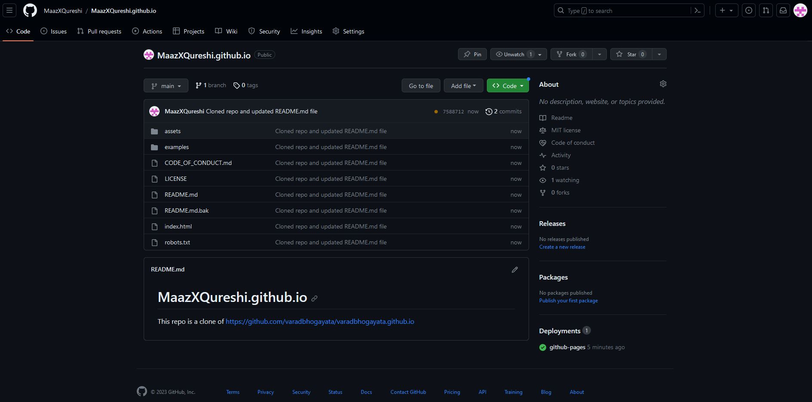

# MaazXQureshi.github.io

This repo is a clone of https://github.com/varadbhogayata/varadbhogayata.github.io

Website link - https://maazxqureshi.github.io/

**Activity 1**

Image References

https://www.renkeer.com/soil-moisture-monitoring-system/
https://t4.ftcdn.net/jpg/03/53/41/47/360_F_353414744_y1RsEmC64y5ACKgyEpSywATpUBUNMFuA.jpg
https://www.amazon.ca/skd-Chat-Room/dp/B07FZN6J2Y
https://www.google.com/maps/about/mymaps/
https://www.macworld.com/article/668718/17-puzzle-games-like-candy-crush.html
https://github.com/spark-uoft
https://en.m.wikipedia.org/wiki/File:React-icon.svg
https://www.reachtech.com/products/touchscreen-display-modules/support/g2-documentation/reference-materials/qml-ui-development/
https://www.amd.com/en.html
https://www.fuh.care/
https://www.eand.com/en/index.html
https://ipwithease.com/cisco-ios-modes-of-operation/

Other images are cloned from github repo - https://github.com/varadbhogayata/varadbhogayata.github.io